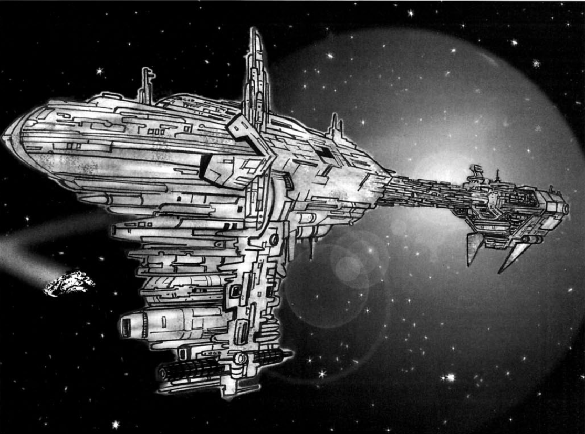
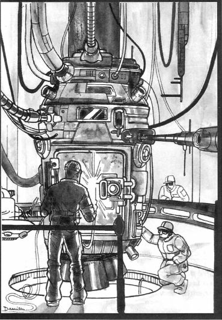
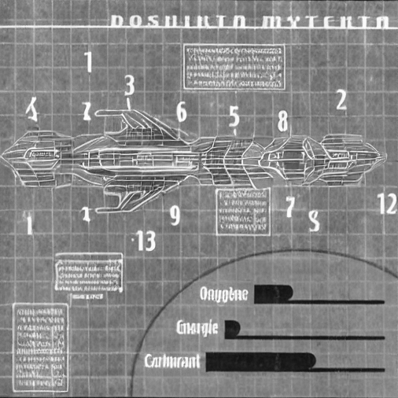
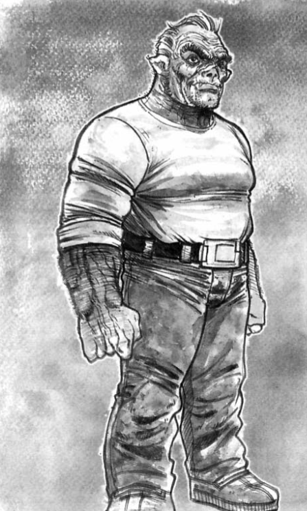

# The Steel Revolt: Episode 1 - The Ghost Ship
#### This adventure is the first episode of "The Steel Revolt," a campaign for Star Wars D6. If needed, it can be played as a standalone adventure. It is intended for adventurers that are relatively inexperienced, who have only had a few adventures in D6. If they are beginners, it might be interesting to start by having them play the scenario "The T-65 Project". The campaign was designed to be run during the Galactic Civil War, but can be modified to for a different period.

**Original Title:** La Révolte d'Acier : Épisode 1 - Le Vaisseau Fantôme  
**From:** Backstab Magazine Issue #28  
**Original Text:** Oliver Collin & Cyril Pasteau  
**Illustrations:** Damien Vanderstraeten & Bertrand Bes

****

## Synopsis
The player characters discover a large ghost ship that has been drifting in space for a very long time. This ship becomes a secret base for the organization to which they belong. If they survive the traps it holds and the assaults from their enemies, the PCs can rediscover a forgotten extraterrestrial civilization.

Seven thousand years before the Battle of Yavin, in a remote sector of the Outer Rim, an interstellar conflict raged between two minor alien races that had limited contact with the Old Republic. The **Syleks**, small humanoid beings similar to Ugnaughts, eventually triumphed over their enemies but at the cost of massacres that forever disgusted them with war (or so they believed). Demoralized and tempered, they withdrew to their home planet, **Syl**, to dedicate themselves to philosophy, forgotten by all. 

Several giant freighters repatriated the settlers from beyond Syl. One of these vessels, the **Doshikta Mytekta** ("Stellar Marsh" in the Sylek language), was refueling, taking on supplies, and transferring common criminals from an abandoned planetary colony when it disappeared without a trace in interstellar space. In reality, one of the transferred psychopaths had a soul consumed and tained by the Dark Side of the Force. While the criminal was cryogenically frozen, his darkness had taken hold of the second officer's mind. In a short amount of time, the second officer sabotaged all vital systems. Half of the crew perished from food poisoning, and the other half managed to escape in escape pods. However, the pods had been sabotaged, and they all died of hunger and thirst. For the player characters, the adventure begins when one of these pods is discovered by their organization.

## Rebels or Imperials?
The adventure assumes that the player characters are  members of the Rebel Alliance. The storyline of the scenario can be kept almost as is when they are part of an organization that does not hold supreme power, such as a smuggler or scout guild, a pirate crew, a merchant association, a band of mercenaries, or agents of the New Republic in a sector controlled by Imperials, etc. 

If the players are affiliated with the Empire or the Old Republic, it's up to the Game Master to play on internal conflicts between secret services, senators, etc., to force them into hiding. The PCs can also be independent like Han Solo and Chewbacca. During the adventure, the group of players are attacked by a powerful fleet sent by their natural enemy in the chosen context (Empire, pirates, aggressive aliens, etc.).

## Capsule
The players find themselves in their usual base, for example, the one described in "The Rebel Alliance Sourcebook." By default, their superior is a charismatic black man in his forties, Captain Murad. If they don't have a personal ship, they are assigned a light freighter RTT-37 (with the same characteristics as a YT-1300). 

Murad sends the PCs on a mission to a remote and obscure location in interstellar space, far from trade routes, to gather coordinates for possible escape points and locate any potential interstellar debris that could hinder hyperspace exits. While they are traveling in the middle of nowhere, the PCs detect a small object in the distance. If they approach and focus their sensors on it, they discover it is a peculiarly shaped escape pod. Its function is evident, but its design is very different from the current galactic standards. The sensors detect no signs of life.

The PCs are free to explore the pod, leave it as it is, or load it into the RTT-37's cargo hold. If they return to the base and explain the situation, Murad asks them to bring back the pod. Inside, they find the mummified corpses of four small porcine-like humanoid beings with bluish-green skin. The pod is equipped with a navicomputer of an unknown model. If the PCs have computer skills, Murad orders them to decrypt the strange code of the machine **(Difficult Computer Programming/Repair Roll)**. Fail or are not qualified, they will need to enlist the help of a specialist, or use outside technicians. This risks the information getting out. Maybe they won't be alone at the wreck later...

The navicomputer only contains technical astrogation data, but it seems incomprehensible and illogical. 

Through careful mathematical calculations, the task of determining the capsule's drift is assigned to the players if they feel capable of handling it. The base's computer provides a bonus of 5 **(Very Difficult Astrogation)**. A successful roll reveals that the capsule has been drifting in deep space for three millennia. Failure means they might have the wrong location, but maybe find clues that help them refine their search (Another escape pod, maybe?).

Eventually, the presumed location of the mothership at the time of the capsule's ejection can be extrapolated. The entire process is highly technical, but the discovery of the ship should create suspense. There might be a treasure within reach, provided they can calculate its location accurately. Captain Murad wants the players to investigate the site, if only for the principle of it. Perhaps there is a wreck that still contains something valuable.

### And if nobody is in command of the Players?
If the players are just regular individuals (smugglers, merchants, etc.), they can claim ownership of the pod. The "space salvage" law permits them to do so. The reason they can decrypt the navicomputer code is either driven by the desire for profit or the inherent curiosity of adventurers, but the outcome remains the same.

## The Ghost Ship
This adventure, being linear by necessity, still offers players a great deal of freedom to maneuver. They would be wise to take advantage of it. Jedi apprentices can focus on the "Taktak case"; smugglers can use their bargaining skills to acquire equipment; diplomats can engage in dialogue with an alien race; and pilots can engage in X-wing battles. The trade-off for this freedom is the need to take relevant initiatives, which is not always easy. The Rebel NPCs - Captain Murad, the technicians, R1, and Zeta-4 - are there for that purpose. If necessary, they can guide the players or even act on their behalf. For example, it is likely that a player will think of programming the Marsh Stellaire's hyperspace route to Syl. R1 only takes care of astrogation if nobody else thinks of it. Of course, the game master should reward ingenuity at the end of the adventure with experience points or character advancement.

Furthermore, to prevent the players from relying too heavily on their advisors, don't hesitate to make them face the consequences of their mistakes. If the players are truly clumsy, consider the following solutions:

- If they fall completely for Taktak's deception, he may end up killing one of them. Taktak attacks the isolated player character. Give the player a chance to perceive the attack and defend themselves effectively, and allow them to call for help. But remember: even Star Wars heroes can die.

- If their efforts to prevent the Empire from locating and destroying the Ghost Ship are unsuccessful, the Empire will triumph across the board, and you, as the game master, can be generous in granting them the consequences of their actions. This could include the Empire gaining a significant advantage or achieving their objectives, potentially leading to dire consequences for the players and their cause.

- If the players refuse to cooperate with the Syleks' demand for punishment against those who "dispersed the souls," or if they fail to deceive the Syleks, Syl refuses to join the Rebel Alliance.

- In this case, the players may face consequences for their actions or lack thereof. They might be captured by the Syleks and handed over to the Bureau of Ships and Services Intelligence (BSI) for interrogation. The exact outcomes and resolutions will depend on the gamemaster's discretion and the direction of the game.

## Points of Interest on the Doshikta Mytekta
- **Command Center:** The onboard computer is out of order, rendering it unusable.
- **Recreation Area:** Artificial mud pools, aromatic saunas.
- **Sabotaged Transmission Station:** The transmission station has been deliberately sabotaged, rendering it inoperable.
- **Galley:** The kitchen area has been contaminated with poisoned food, making it unsafe for consumption.
- **Crew Quarters:** The living quarters of the ship's crew, containing personal belongings and sleeping areas.
- **Captain's Cabin:** The captain's cabin shows signs of a previous battle, with visible traces of damage and combat.
- **Hangars:** The hangars are filled with destroyed heavy fighters, deliberately rigged by the second officer, Taktak, to explode upon departure. The damage is comparable to a thermal detonator explosion.
- **Armory:** The armory is locked, and the access code is encrypted on a data block. A successful **(Moderate Computer Programming/Repair Roll)** is required to decrypt the code and gain entry. Failure fuses the door.
- **Sealed Holds:** The sealed cargo holds still contain air, maintained at a suitable temperature by vindictive maintenance/cleaning/extermination droids. Hundreds of frozen dead rats lie in what used to be a food reserve. One small hold contains soul essence collectors (according to Sylek funeral rituals, the body is processed to obtain a small vial of pure scent considered to be the soul). The majority of the storage holds contain millions of tons of a fuel only used by Sylek ships.
- **Secure Pods:** Closed pods with security codes contain cryogenically frozen criminals. Only one of them has survived bodily functions (This is Taktak). Opening the armored pod requires a security code found in the captain's data block.
- **Auxiliary Compartment:** An annexed compartment houses a cryogenic chamber that appears to have been used during the journey. A carbonite block contains a mustachioed chergol, a small creature resembling a mix between a cat and a monkey. The captain's log indicates that "Krok" behaved strangely (at one point possessed by Taktak's spirit), leading the captain to choose cryogenic suspension for the creature for the journey back to Syl.
- **Engine Room:** The ship's reactors have been sabotaged, rendering them inoperable. The cause and extent of the sabotage should be investigated to determine if repairs are possible.
- **Lower Decks:** The lower section of the ship is flooded with frozen water, possibly due to a breach in the hull or malfunctioning systems. The frozen water presents a physical obstacle and may require drainage and repairs before further exploration can take place.

# Phase 1
## Discovery and exploration of the starship
Upon discovering the spacecraft, the players will find that it poses no particular challenges, given that its coordinates have been calculated. It has remained in the same position for three millennia and, furthermore, it is intact and enormous! It is a heavy cargo ship that is longer than an Imperial Star Destroyer, with a long tapered cylindrical hull with massive stabilizing fins. Access to the ship can be gained through an open hangar on the top. The corridors are small, requiring taller humans to walk hunched over. However, the rooms are of normal size. The majority of the ship is devoid of any atmosphere. Numerous Syleks, victims of food poisoning, lie on the floor, frozen.

## Return with the good news
Captain Murad is thrilled by the discovery of the ship. After careful consideration, he decides to convert it into a fallback base. This way, if their current base is discovered by the Empire, they will have a valuable alternative. He entrusts the players with overseeing the operation and establishing a functional base as quickly and discreetly as possible. Murad suspects that an Imperial spy may have infiltrated their organization. He is willing to provide some funds for repairing the Swamp Star, but due to the Rebellion's financial difficulties, the players will receive only the bare minimum. They must negotiate fiercely to secure even that amount **(Moderate/Difficult Bargaining or other interpersonal rolls)**. Failure means they're going to have to scavenge or scrounge on their own for needed parts. There might be some interesting side quests to be found here.

To maintain the secrecy of the base's location, only five technicians from the organization will directly assist the players. The rest of the team consists of eight GLB worker droids ("Gel Bee"), an old R1 astromech droid, and a Zeta-4 protocol droid.

# Phase 2
## Refit of the Emergency Base

The players are free to carry out the tasks they desire. However, if they don't think of it, one of the technicians assigned to the project points out that certain tasks are a priority. It is necessary to check and reinforce the shields, inspect the hull, seal various sections, provide air, supplies, and a multitude of equipment parts, repair the onboard computer and the communication station, and fix the sublight reactors and hyperdrives. All these tasks involve heavy equipment, which needs to be obtained from Captain Murad, purchased, or stolen from somewhere while ensuring the secrecy of the Marsh Star's location. To acquire heavy equipment, the black market is the easiest solution. The supplement "Tramp Freighters" describes an area suitable for such operations: the Minos Cluster. If desired, this is an opportunity to expand this part of the scenario.

**Plot Twists or Hooks**
- If the players wake up the mustachioed chergol, this pet creature becomes attached to the first person who speaks to it in Sylek (most likely Zeta-4).
- Mynocks attach themselves to the players' ship en route to the Marsh Star. Unless detected and eradicated quickly, the giant cargo ship is doomed, or at least the work the players have put into it can be undone. The Asgau-3 maintenance droids might help (or hinder) here.
- If the players don't wake up Taktak, they have certain nightmares that prompt them to awaken the criminal, thinking that he can solve their problems. Although Taktak doesn't consciously use the Force, he is one with the Dark Side.
- If the players wake up Taktak, the Sylek criminal first tries to gain their trust. He pretends to be a cryogenically frozen patient for health reasons (remember the movie "Dead Calm"). He explains the crew's death as a result of a terrible disease. When he deems the moment right, he begins committing gruesome murders at a rate of one per day. Technicians and rebel soldiers are found eviscerated in various places. Once he believes he has been identified as the murderer, Taktak retreats into the depths of the ship.
- If the players thoroughly search the captain's cabin **(Moderate Search Roll)**, they discover a hidden compartment containing the captain's encrypted logbook **(Moderate Computer Programming/Repair Roll)**, after Zeta-4's translation). The logbook allows them to reconstruct the events and identify Taktak as a criminal. Taktak was sentenced to thirty years of torture for committing crimes that earned him the nickname "The Ripper." If the players don't search the captain's cabin, you can consider that some other Rebel eventually comes across the logbook if you're feeling lenient.

# Phase 3
## Imperial Offensive
The day arrives when the Rebels must abandon their previous base and  Captain Murad decides to relocate his rebel unit to the Marsh Star, narrowly escaping an Imperial bombardment. The PCs are tasked with assisting in the reception. Five hundred people arrive, along with a Corellian corvette, three YT-1300s, five X-wings, and five Y-wings.

The following day, the officer in charge of communications is found unconscious. Examination of the communication equipment reveals that a hyperspace message was secretly transmitted from the ship! Captain Murad then asks the PCs to focus all their efforts on finding a probable Imperial spy. The only clue is the data capsule used for the transmission, which is empty of information, but its odor may help track down the spy if the PCs have the presence of mind to use Krok's sense of smell. If the saboteur is exposed, they attempt to escape and hide in the flooded part of the ship with diving equipment.

Two days later, a general alarm is suddenly triggered. Sensors have detected the arrival of an Imperial attack force, consisting of a Victory-class Star Destroyer. Immediately, TIE fighters begin their assault. Captain Murad orders an escape into hyperspace, but the hyperdrives refuse to activate.

The PCs must quickly intervene to repair the hyperdrives and enable the Marsh Star to escape before it is captured by the Empire.

During the battle, the PCs must face the onslaught of TIE fighters and try to repel the Imperial attack. They can use the ship's defenses, operate the laser cannons, and coordinate the actions of the rebel pilots to counterattack.

If the PCs succeed in repairing the hyperdrives in time, the Marsh Star can escape into hyperspace, avoiding destruction or capture by the Empire. However, if the repairs take too long or fail, the rebel ship remains vulnerable and can suffer heavy damage or even be annihilated by Imperial forces.

The success of this phase depends on the technical, tactical, and coordination skills of the PCs, as well as their ability to make quick and effective decisions in intense combat situations. While some X-wings and Y-wings attempt to limit the damage, all base technicians are requisitioned to rapidly repair what turns out to be sabotage.

In fact, the sabotage was directly carried out against the hyperdrive. The Imperial agent remained on site to prevent any repairs. They locked themselves in and ambushed in the engine room. Ten Rebellion droids (of various models) stand guard in front of it, blocking the way for the PCs and fighting until their destruction. They attempt to explode the machines to destroy the ship. If captured, they claim to have been reprogrammed by the spy. In reality, they obey the instructions of **The Entity**, an artificial intelligence residing on the moon of Syl (see below) that does not want its hiding place discovered. Once the droids have been dealt with, the Imperial spy must be defeated in order to carry out the repair **(Difficult Capital Ship Repair Roll)**. Remember the ending of the film "The Hunt for Red October."

Once the repair is completed, R1 initiates the hyperspace jump. In communication with the navcomputer, it decides to follow the route that leads to Syl, as it avoids calculations that would further delay the departure. Indeed, when the navcomputer was brought back online, it recalculated the route to its initial target: Syl.

**Plot Twists or Hooks**
- After a stay at Murad's headquarters, one of the PCs unexpectedly discovers a hyperspace tracer on the hull of the RTT-37. This proves that an Imperial spy present in the base is trying to determine the location of the Marsh Star. From then on, the PCs should be even more vigilant to preserve the secrecy of the fallback base.

- The behavior of certain droids within the PCs' organization subtly changes. While some maneuver subtly to be assigned to various missions, others mysteriously disappear while their rebel masters are organizing a resistance network on an occupied planet. In reality, these droids are following the orders of an unknown robotic faction, distinct from all human and extraterrestrial organizations. If they are interrogated or examined, their memory appears to be void of any abnormal interference, thanks to a program that erases the data as access is attempted. Zeta-4, however, remains faithfully by the side of the PCs, secretly recording everything it sees and hears. One day, an accident occurs and a half-dozen droids are found broken into irreparable pieces due to a supposed maneuvering error by a Guelbé. From that moment on, the productivity of the droids significantly declines, without any apparent technical reason. The Game Master should not assist the players in realizing this immediately. In galactic society, droids are considered walking scrap metal; no one bothers to consider how they spend their leisure time. The behavioral modifications of the droids become increasingly significant and will be explained in subsequent episodes of the campaign. The PCs cannot unravel their mysteries at the moment.

# Phase 4
## Escape, Discovery of Syl, and Diplomacy

Syl, in the Sylek language, means "the Sea." Justifiably so: it is a vast swamp covered with semi-aquatic cities. The technology is at a space level but abandoned. The whole old war fleet is abandoned on the moon of Sy. Captain Murad thinks it could be very valuable in the fight against the Empire. He asks the PCs to help convince the Syleks to join the Rebel Alliance. 

As a result of a long decline, the people of Syl are bored in their marsh cities. They are tired of growing vegetables. They get excited when they learn that there is a good fight in the stars, and they want nothing more than to participate. But they still need a good excuse because they don't want to attack anyone without being "invited" by circumstances. The PCs can convince them to join the battle by mentioning the Empire's xenophobia, its tyrannical and unjust laws towards aliens, and the massacres it commits against civilian populations (like the destruction of Alderaan). 

However, there may be a problem. If at any point, animic essences have been opened or inhaled, the Syleks consider it a violation of the gravesite and "dispersion of the soul." In this case, they demand reparation. They insist that the culprits be delivered to them so that they can undergo a stay at the Palace of White Pain on Syl. The Syleks absolutely refuse to provide any details, given that "mentioning this terrible place attracts dispersed ghosts." In reality, it is a month-long stay in a kind of deodorized monastery, not unpleasant at all according to human standards. However, after this treatment, the penitents lose all body odor and cease emitting any. 

If the PCs try to evade the punishment, they are attacked, and the Rebels are expelled from Syl. Fortunately, smart players can either manage to deceive the Syleks in some way or understand the nature of the punishment, which is not terribly frightening to an average PC. If the PCs have explicitly protected the essences from the beginning, this ordeal is spared for them.

## A New Ally for the Rebellion

If the PCs manage to rally the extraterrestrials to the Rebel cause, the entire Sylek civilization regains its dynamism. The PCs rise in rank if they belong to the military structure of the Alliance. Rebel technicians arrive. After a few months, workshops begin producing ships and fighters in large quantities. Soon, the Empire is harassed, but it cannot retaliate because it is unaware of the location of Syl. The Old Republic had some fragments of information on the subject, but the archives are held in the former sector prefecture of Dablek VII. The next mission for the PCs is to destroy or falsify these archives.

## Coming soon on your holo-screens...

The rediscovery of Syl doesn't sit well with certain secret factions. But by the way, are all these events—the discovery of the capsule, the ship, and Syl—really coincidental? Wasn't it R-1 who initially suggested choosing to inspect the sector where the capsule was found? What kind of relationship do the droids have with Syl? Find out in the next episode of the Steel Rebellion campaign...

# Statistics
The characteristics below are intended for a group of beginner PCs. It is up to the game master to adjust the power level of the protagonists according to their own group.

🔳 **Asgau-3 Maintenance Droid**  
Antique Maintenance Droids    
**All stats 1D except:** *Melee Weapons: Harpoon 3D, Technical 1D+1*   
**Equipment:** Multi-functional Harpoon (Damage 1D+1)  
**Capsule:** Overworked from their battle against rats millennia ago, the Asgau-3 droids are not worth much anymore. Only three of them are still operational when the PCs arrive. They perceive the intruders as "organic nuisances" and attempt to eradicate them. They are dangerous because their strikes can pierce through space suits, leaving the PCs vulnerable to the freezing temperatures of the ship.

🔳 **Krok the Mustached Chergol**   
Companion/Pet  
**Dexterity 4D+2** *Pickpocket 5D*  
**Perception 2D** *Con: Voice imitation 4D, search 5D*  
**Strength 1D+1** *Climbing/Jumping 5D*  
**Capsule:** Krok is a cute and harmless critter that tags along and causes mischief. Originally they might be a suspicious foil--are they the assassin? But it should become evident that they are harmless. Playful and affectionate, he quickly becomes everyone's friend. Krok has a habit of bringing back items marked with his scent to everyone.

🔳 **Taktak**   
Sylek Criminal  
**Dexterity 4D** *Projectile Launcher 5D, Melee weapons 4D+2*  
**Knowledge 1D+2**  
**Mechanical 2D**  
**Perception 3D+2** *Sneak 5D, Con 4D*  
**Strength 4D** *Brawling 5D, Swimming 5D*  
**Technical 2D+1** *Security 4D*

The Syicks are porcine humanoid beings, averaging 1.50 meters in height, highly muscular and agile. Their bluish-green skin reveals their amphibious origin. Their appearance is far from humorous and even betrays a formidable predatory nature!

🔳 **Cheral Kohn, also known as Djar-Y**   
Imperial Spy-Saboteur  
**Dexterity 3D** *Blaster 4D, Melee weapons 5D*  
**Knowledge 2D**  
**Mechanical 2D** *Communications 6D*  
**Perception 3D+2** *Sneak 5D, Con 4D*  
**Strength 3D+2**  
**Technical 3D** *Demolitions 6D*  
**Equipment:** Concealed Hold-Out Blaster (Damage 3D)  
This spy infiltrated Captain Murad's rebel organization. If your players have seen the movie "The Hunt for Red October" and you want to give them a small hint, assign him the role of a technician chef (it's quite an art to adjust an auto-chef to produce the perfect meal).