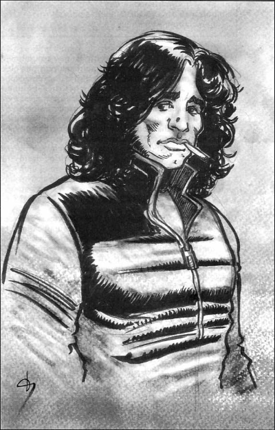
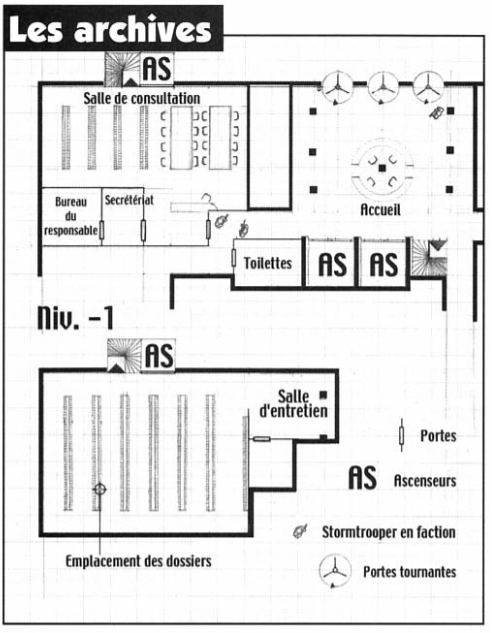

# The Steel Revolt: Episode 2 - Soft(ware) Parade
#### This adventure is the second episode of "The Steel Revolt," a campaign for Star Wars D6. The player characters (PCs) have rediscovered an extraterrestrial race, the Syleks, and have successfully rallied them to the Rebellion. If you are playing in a different Era, you will need to adapt the scenario. This installment is intentionally linear. It is intended for PCs with some experience.

**Original Title:** La Révolte d'Acier : Épisode 2 - Soft(ware) parade  
**From:** Backstab Magazine Issue #29  
**Original Text:** Oliver Collin & Cyril Pasteau  
**Illustrations:** Damien Vanderstraeten & Bertrand Bes

****

## Synopsis
The PCs are tasked with inspecting the remains of the **abandoned Sylek fleet** stored on the moon of the planet. Unexpectedly attacked, they must eliminate droids who also intend to get their hands on the rearming Sylek armada, much to their surprise. A ship will escape into hyperspace. Pursuing it, the PCs arrive at the scene of a massacre of human settlers by **droids**. They then discover a community of free droids who try to prove their innocence by helping them raid the former sectoral prefecture of **Dablek VII** to eliminate any evidence of the Syleks' existence and understand which entity is responsible for the carnage.

## History's Secrets

Long ago, a collective of non-human races from the Old Republic attempted to unify the galaxy under the guidance of an artificial intelligence (AI). The project was launched and nearly completed. The Syl system was chosen as the location for the creation of the entity, and the moon of Syl was modified for this purpose. However, the researchers quickly realized that they didn't have enough space to develop the AI. A new site was chosen, and the transfer began, but the project faltered as it violated an ancient rule prohibiting the development of super-computer entities. The pro-human Senate of the Republic decided to halt the research altogether. The assembled components were destroyed, and the archives containing all the data were erased.

However, one of the project initiators refused to see their work destroyed. They kept a portion of the data and gave birth to an AI. Taking refuge in an uninhabited world, the AI thrived by utilizing wave relays to stay informed and recruit conditioned droids. Driven by a logic of constant expansion, the AI devised a long-term plan to dominate the galaxy. It created a new entity called a **cybrid**, which combines the abilities of droids with human improvisation and, most importantly, the ability to evolve. The first and only prototype of the cybrid is named **Jimmorr Ison**, using the DNA of a quasi-human mythical poet. However, Jimmorr rebelled and gained his independence. He gathered a few fellow droids and fled to the Elektra system, where he established a free community.

The AI fears that it has created an entity that is as superior to itself as it is superior to its creators. As a result, it created a new type of servant: the cyborgs. While they may not possess the same decision-making capabilities as a cybrid, they offer the advantage of being quality warriors. The AI secretly reoccupied the moon of Syl to seize control of the Sylek war fleet and establish its own empire. To successfully combat humanity, it needs resources to assemble an army. It also seeks to eliminate the Jimmorr Ison, its renegade "offspring". To locate him, the AI has utilized a vast network of reprogrammed droids leading normal lives in the service of their apparent masters while regularly reporting to the AI's agents. It knows that Jimmorr has enabled numerous droids to gain their independence and, therefore, is well protected. Recently, it has also learned that Jimmorr is hiding on the planet Elektra.

During the time of the Republic, the purely computer-based AI used the instant communication network to travel throughout the galaxy. However, since the rise of the Empire, which closed off this network, it no longer has that capability and remains hidden within the digital depths of the Syl moon. But it has modified the Sylek flagship to serve as its base of operations. Furthermore, it has equipped the ship with an ultra-sophisticated communication system that allows it to download itself to a backup hideout when necessary.

**And if... the players didn't play the first installment?**  

Uh, [click here](https://github.com/DarthBanjo/swd6-fr-adventures/blob/main/28.md).  

 Jokes, aside -- the players are delegated by someone above them to establish relations with a planet called Syl, whose unknown inhabitants claim to want to fight the Empire. They are tasked with assessing the Sylek military arsenal.

## Astromech droid vs Protocol droid

Unless they were destroyed, R1 and Zeta-4, the Rebellion droids, still accompany the players. However, it is unlikely that the two droids will continue to interact if you have played the previous episode. In fact, R1 is a free droid with safeguards against reprogramming, working on behalf of the cybrid, Jimmorr Ison (as the droid wants his freedom maintained). It was R1 who maneuvered to lead the players to discover Syl in order to hinder the activities of the AI. During this installment, R1 tries to advise the players on the right path to follow. On the other hand, Zeta-4 is an agent of the AI, and if the players threaten its interests, it will turn against them at the worst moment. Zeta-4 may not be strong in combat, but it can easily program the depressurization of a room or any other maneuver of that kind. Otherwise, it simply gives the players bad advice.

Special programs, which destroy data when accessed, prevent anyone from searching the droids' circuits to find out who their sponsors are or where they are hiding.

# Phase 1
## A mission so simple!

Captain Murad, the superior (or former superior) of the players, has informed the leaders of the Rebellion about the discovery of Syl. The Syleks have reached a democratic consensus and agreed to reactivate their old fleet, which has been locked in the booby-trapped underground of **Mykshi**, Syl's moon, since they ceased their martial activities.

A small group of Syleks, who know the ancestral deactivation codes for Mykshi's defenses, accompany the players in their small ship. They are given a holographic blueprint of the base and a list of the stored equipment. Equipped with a light RTT-37 cargo ship (with the same characteristics as a YT-1300), the players approach the base, slightly behind the Sylek vessel. By succeeding in a **difficult Sensors** check, the pilot or co-pilot realizes at the last moment that the defenses are still active, which grants a bonus (at the Game Master's discretion) to their Space Transports or Pilot checks to escape laser fire and missiles from the base. Jamming prevents communication of the situation to Syl. The Sylek ship manages to fire a salvo of missiles at the massive entrance gate of the base before being destroyed by lasers. However, the missiles create a passage through which the RTT-37 can quickly maneuver, evading the missiles **(a very difficult maneuver)**.

Inside the base, the RTT-37 can dock with an airlock, allowing the players, who find themselves alone, to enter the heart of the underground complex. A long narrow corridor, barely illuminated by safety lamps, leads to the interior of the base. The players may notice that the site is not abandoned. The power is connected, the corridors are clean, and they hear numerous mechanical noises suggesting intense activity. The base extends for hundreds of kilometers and, most importantly, it has a main central hangar.

The players find themselves in awe as they arrive at the suspended docks and witness a sight beyond imagination: a thousand ships of unimaginable size. Some of these vessels span several kilometers in length. The majority of the ships have been restored and brought back to working order. Any character with the Capital Ship Repair skill or Knowledge of Engineering realizes that even though the ship technology is outdated, but their sheer power and numbers make this relic from a bygone era one of the most formidable fleets in existence.

## Spotted!
At some point, the players come across droids busy emptying a room filled with clearly military equipment, preparing to transport it to a ship. If the players didn't take the effort to hide, they come face to face with the robots, who then sound the alarm and attack the intruders. Speakers throughout the base announce that the intruders have been located in Room 5465. The message is revised each time a robot spots the players, and they will be pursued by the droids. The number of robots the players must face is left to the discretion of the game master, considering the group's firepower. While relatively few droids focus on the players, the majority of them are occupied with preparing the fleet. These combat droids belong to an unknown type. They are not Sylek droids and were not part of the base's initial defense system. Attempts to interrogate them prove futile as they remain silent, and their memory appears to be wiped clean of any abnormal interference thanks to a program that erases data as it is accessed.

A search through the base's computer system is possible, but the players must read the Sylek language with the assistance of a protocol droid. Through this, they can learn that the base has been operational for a long time. If the players attempt to establish connections with galactic history, they may realize that the base became active after the closure of the Old Republic's HoloNet. They may also note that the activity became frenzied after the Stellar Marsh arrived on Syl (in the previous episode) and that long-term activities such as construction have been abandoned in favor of ship renovations. If the players try to sabotage the base's power network or deactivate the security systems, they soon realize that they are unable to match the countermeasure computer programs (the AI is unbeatable on its own turf).

## The end?
At some point, the AI stages the evacuation of the base. The main power is cut off, and a deafening noise fills the corridors. The fleet, piloted by droids, leaves the base. On all computer screens, a series of data scrolls by: departure orders and flight plans for the different ships. 

The **Tysha Daun** (Sylek for Crystal), referred to as the flagship, appears multiple times on the screens. Its destination is **Elektra**, an unknown system with provided coordinates. However, it is actually a decoy intended to lure the players to the cybrid's hiding location. All the other ships are destined for interstellar space, and any attempt to follow them results in failure. They have actually departed for a different destination and will not reappear in the episode. If the players hurry and use the map as a guide, they have enough time to witness helplessly as the ship takes off (similar in characteristics to a Guardian-class light cruiser).

 At that point, they can leave the base since the defenses have been deactivated by the AI. Eventually, the base is occupied by a garrison composed of Syleks and Rebels and is used as a shipyard. The Syleks confess their ignorance regarding the occupant of the base. They ceased space travel millennia ago, and the grand project in which their ancestors participated has been forgotten.

## And if... the PCs don't pursue the Tysha Daun Vessel?
Rebel technicians arrive later at the base and confirm the flight plan of the ship, the only one that doesn't lead to nowhere. Captain Murad or another commanding officer orders the PCs to embark on the pursuit of the flagship in order to determine what happened and if it's possible to regain control of the fleet. It is also crucial to prevent the Empire from discovering its existence.

# Phase 2
## Onward to adventure!
The players head towards the Elektra system. Using the sensors of their ship, they quickly discover the presence of a small town under construction and a few scattered dwellings on the planet's sole continent. They also locate the Tysha Dawn ship that escaped from the moon Mykshi. It is abandoned and contains nothing of interest. If the players decide to communicate with the authorities to request permission to land, their messages go unanswered. A rudimentary spaceport is set up near the town, and the only ship present is an old frieghter (use YT-1300 stats).

..they eventually come across a horrifying scene. There is no sign of life, only a few droids wandering aimlessly, performing tasks known only to them. Large bird-like creatures resembling vultures soar above the city. They fight over the multitude of corpses rotting in the dwellings (mostly) and scattered throughout the streets (a few). Signs of battle are evident: numerous droid carcasses bear blaster fire marks. If the players enter the town, they become attacked by the remaining wandering robots—a handful of protocol droids, medical droids, repair droids, and others.

If the players find themselves in difficulty, a group of colonists from one of the agricultural farms on the continent suddenly appears and lends them a hand. The colonists were alerted by survivors who managed to escape the massacre. They lead the players to the farm, where a dozen bewildered survivors are trying to forget the horrors of the night. The witnesses recount that just one night ago, the inhabitants were attacked in their sleep by their own droids. Those who could flee sought refuge here. They don't understand what could have happened. A young boy remembers seeing a group of robots leaving the town and heading towards the mountains during his escape. The farmers agree to help the players and provide them with a guide to track down the murderous robots.

**The Elektra Star System**  
This small system consists of a single sun and two planets. 
The first planet is a large gas giant, while the second planet offers livable conditions for humanoid beings. It has a gravity of 1 g and is covered by 90% water. The planet's surface features lush vegetation, with a tropical climate. Recently, colonists seeking to escape Imperial influence have settled on the planet. A small town with fewer than a hundred inhabitants has emerged, along with scattered agricultural and mining operations across the continent. Additionally, the planet is home to a hidden colony of free droids, nestled in the mountains and led by the charismatic cybrid known as Jimmorr. The colonists speak of a hidden city inhabited by beings of light, survivors of an ancient civilization long gone (though this rumor is false, of course).

**Ship of Fools**  
The ship that fled the lunar base carried a cyborg named **XTC-3005**, who was loyal to the AI. It landed on Elektra and orchestrated the massacre of the population by reprogramming the droids in the human colony. The AI plans to exploit the anger of the colonists and players to bring an end to **Venice**, a small free droid colony led by the charismatic cybrid, Jimmorr Ison, by making them believe that he was the one responsible for the carnage. Remember that the AI wants Jimmorr's demise.

## On the trail of the killers 
The murderous droids leave easily traceable tracks that lead towards the mountains. If a local guide has joined the party, it is a forty-year-old man named **Taldek**. He shares the legends surrounding an ancient civilization believed to have left remnants in the heart of the mountains. Taldek himself has attempted to discover them but considers it more of a children's tale than reality. Given the speed at which the droids are moving, he believes the party should quickly catch up to them, especially since the progress becomes more difficult once they pass the mountain foothills. Meanwhile, the cyborg XTC-3005 is searching for the best place to set up an ambush to further frustrate the pursuers. He uses the slower droids to slow down the party, allowing the other droids to reach the vicinity of Venice before being caught.

The community is located inside a small valley filled with lush vegetation. To enter the valley, one must pass through a tunnel that is 12 meters wide and 130 meters long, concealed by a holographic image. Sensors automatically alert the residents of Venice whenever someone enters. Machines designed by Jimmorr hide the valley from external sensors, making it indistinguishable from the surrounding landscape. The droids under XTC-3005's command enter the tunnel shortly before the arrival of the party, who, intrigued by the disappearance of their targets, may discover the hidden entrance. The residents of Venice, alerted by the sensors detecting intruders, gather near the tunnel's exit. Once the party is inside the passage, the droid follows them, intending to strike at the right moment, preferably after the party has engaged him. Killer droids, lying in wait inside the tunnel, viciously attack the party. They are outnumbered and easily defeated. Afterward, the party can exit the tunnel and come face to face with the citizens of Venice.

## Such a lovely little village

In the midst of a labyrinth of vegetation, the structures of Venice come into view: a square, defined pathways, sculptures, and more. The village consists of about twenty buildings built into the mountainside. There is an underground space primarily used for machinery and storage, as well as a vacant spaceship launch pad. Several common model landspeeders (such as the SoroSuub XP-34) and a barge resembling the Ubrikkian Bantha 11 are parked nearby.

Currently, around fifteen droids reside in Venice, with three other residents off-planet to retrieve electronic components. The community strives for self-sufficiency but still needs to acquire materials from elsewhere. It is often during these expeditions that one or two new members join the utopian republic of Venice.

Each individual goes about their tasks, free to pursue their desires as long as they contribute a certain number of services to the community (usually logistical tasks). Decisions are made through collective discussions and consensus, with Jimmorr serving as a respected leader and facilitator. The atmosphere in Venice is one of camaraderie and cooperation, with a shared goal of freedom and peaceful coexistence for all droids.

The players can interact with the inhabitants, learn more about their unique personalities and contributions, and witness the harmonious functioning of this self-governing community.

Venice is governed by a council composed of its members, who convene for weekly meetings. Some positions within the council are filled through limited-term elections. The droids in Venice make significant efforts to learn and mimic inherent traits of humanoids, such as the sense of celebration. As a result, Venice takes pride in having a gardener, a sculptor, a composer, a music group dedicated to performing the songs hummed by Jimmorr, a poet, and citizens engaged in various research pursuits. To the observing player characters, the community might appear as if a gathering of droids has gone haywire.

**Love Street**  
To describe the village, you can draw inspiration from the universe of the television series "The Prisoner." There are delightful little houses, well-ordered and immaculate. Everything is perfectly maintained. Nothing disturbs the tranquility of the residents. The lawns are meticulously trimmed, the pathways are perfectly straight... But there is an atmosphere of celebration, of joviality. The inhabitants have chosen to be here; they yearn for peace and, above all, for freedom.

**Ideas of Droids**  
R1, who accompanied the party thus far, reveals his true identity as a secret fighter for the cause of free droids. He forms a bond of friendship with another unit, *01100110 01101100 01101111 01110111 01100101 01110010* ("Flower", in binary), who is enamored with poetry and emits binary odes to the delight of the community. As an agent of Venice, R1 had never visited the sanctuary before, so he is excited to meet Jimmorr, the mastermind behind the discovery of Syl to counter the manipulations of the AI that created him.

It is up to the Game Master to create unique indigenous droids that defy expectations. Perhaps there's a medical droid obsessed with sculpture or a former assassin droid with a passion for gardening. The possibilities are wide open. The inhabitants of Venice have developed strong personalities that diverge from their original programming, showcasing their individuality and independence.

**The Robotic Messiah**  
Despite all of Jimmorr Ison's efforts, the other members of the community silently worship him. They consider him to be the third stage of intelligent evolution, following organic life and artificial intelligence. They are willing to sacrifice themselves for him. However, Jimmorr refuses to be put on a pedestal because he adheres to egalitarian principles.

## Rapidly unfolding events

Should the players choose to eliminate the droids without questioning or listening to their pleas, they would earn 1 Dark Side point. Once their task is done, the heroes can return to Syl without knowing much more; the AI allows them to leave unless they become an easy prey. 

If the players approach the droids without shooting first, they are surprised and frightened. They don't understand how the players found the entrance to the valley. They don't comprehend the story of the human massacre. Jimmorr appears annoyed by this news. At this point, several scenarios can unfold.

- **The players arrive without a local guide:** Before the players can discuss further, blaster shots erupt from various directions. It appears that some of the colonists, guided by a few AI-influenced droids, have reached the entrance of the tunnel. Without asking questions, they open fire to eliminate the presumed assassins. The only peaceful solution for both the players and the citizens of Venice is to escape using the landspeeders and the barge. They must avoid the gunfire before they can reach a spaceship. The colonists do not immediately pursue the fugitives, as they prefer to search the village for any potential prisoners. On the other hand, XTC-3005 attempts to eliminate Jimmorr, taking advantage of the chaos. If Jimmorr survives, he tries to reach a spaceship to notify his master and await further orders.
- **The players arrive with a local guide:** Taldek poses a problem. For him, it is unthinkable to negotiate with assassins. He assesses the players, and if he senses their reluctance, he slips away to alert his fellow colonists via comlink. He provides them with the location of the community, and the farmers arrive shortly after in landspeeders to launch an assault (as described above). If the players manage to neutralize Taldek, they have the freedom to negotiate with the community. In this case, XTC-3005 attempts to leave the planet to inform his master about the situation.

## On the side of the droids
Whether in the calm of Venice or during the hyperspace journey to Syl, the players have the opportunity to hear the droids' version, provided they understand that they are not enemies. Jimmorr explains what he is, his history, and what he knows about the AI. He admits to not knowing how to fight it or where it is located. The only solution would be to trace the researcher who brought the AI into existence, if that is still possible after the passing of millennia. The cybrid is willing to join forces with the players, as well as the other droids, to combat the vile entity. Moreover, Venice must be evacuated because the site is now known to the AI. Jimmorr asks the players not to disclose his existence to others who are not droids. Aware that he is a coveted asset, he does not want to become a curiosity, the subject of numerous conflicts. He also requests that the players provide him with a plausible alibi for their superiors. It's up to the players to come up with a convincing story, or else Jimmorr will fabricate one.

## And if... the PCs betray Jimmorr?

The players may decide to reveal the true identity of the cybrid. He is placed in isolation awaiting the arrival of prominent rebel roboticists who will study him to understand his mechanisms. The players soon learn of his escape. They gain 1 Dark Side point but also earn relentless enemies. They will never be able to turn their backs on a droid without fear again.

# Phase 3
## Securing Syl
Upon their return, the players are invited by Captain Murad to give their report. The captain explains that the location of Syl is kept secret within the Alliance itself to avoid any Imperial attack. Before using the planet as a secret base for the struggle for freedom in this sector, the high-ranking officials of the Rebellion demand that the Empire cannot discover it.

The problem is that the location of the planet is located in an ancient archive on Dablek VII.

Captain Murad, on behalf of the High Command, assigns the players the task of retrieving the documents and bringing it back to Syl. Who knows, they could shed some light on the entity or faction that stole the fleet. The players are provided with all the equipment they believe they'll need to carry out their mission. The Alliance intelligence services provide them with all available data on the location and personnel present, as well as partial information on the security systems. The players must plan their mission carefully to successfully retrieve the data. It's up to the Game Master to provide them with information that can serve as a basis for devising a solid plan to discreetly steal the archives.

## A visit to Chang'an
The Rebellion takes care of providing the players and their transport ship with valid identities, allowing them to pass through Imperial customs without obstacles (a shuttle in orbit). At the spaceport, the players may notice racks of TIE fighters. They are given the address of a safehouse where they can prepare their operation, as well as access to a warehouse equipped with landspeeders provided by the local resistance network. However, the players have been instructed to limit contact with the local Rebellion cell. If, for an important reason (such as essential equipment for the raid), they absolutely need to contact them, the players just need to open a small window on the roof.

The safehouse is located downtown, about ten minutes' walk from the spaceport and the municipal building. The municipal building is open from 9 am to 6 pm every day except weekends. The archives department is located on the ground floor, right next to two shock troopers on guard duty, rotated every six hours. Only authorized personnel are allowed to freely enter the premises. Visitors must make an appointment and provide an identity and verifiable address to access the consultation room. While it is possible to view the archives on a monitor, physical access to the actual archives (the black cylinders) is prohibited. When an archive is accessed, the corresponding base of the cylinder is connected to the local computer network. In the evening, when the service closes, volumetric alarms are activated. Additionally, the alarms in the archive rooms are directly linked to a post of Imperial guards who can respond anywhere in the building within 1D4 minutes (the number of soldiers is up to the Game Master's discretion). Two shock troopers also remain on guard duty outside the building.

### The personnel of the archives department consists of:

- **The Director:** Carl Toureau has been relegated here as a punishment for his corruption. He is eager to seize any opportunity to regain the favor of the governor. He spends his days doing nothing.
- **A Droid Librarian:** This droid can be persuaded if the players have brought Jimmorr with them. If so, the droid requests to accompany them. The droid can provide the exact location of the files: basement, reference code SESR-567-CC, location 67A, aisle 4.
- **A Young Secretary:** Elise Kaal can provide some information (names and ranks, for example) about the Imperials currently working with her.
- **A Hall Attendant:** Alan Sawney is responsible for enforcing the rules and assisting researchers. He can also help locate the data, although not as efficiently as the droid.
- **Three Imperial Data Analysts:**
  - Captain Alec is tasked with identifying information that could be of interest to the Empire. He is diligent but not overly zealous.
  - Lieutenant Ennis is a tired man who is counting down the days until retirement. 
  - On the other hand, Lieutenant Rawn has just graduated from the officers' academy. He expected a more exciting mission, but he is committed to his work.
  
  The three officers are loyal and will not betray the Imperial cause. They take turns at the reception desk with Alan Sawney. They have lunch elsewhere at noon.

**The Music Isn't Over**  
Jimmorr Ison shares a certain kinship with the lead singer of *The Doors*. With his group of droids, he continues to sing. To enhance the game, it would be fitting to use the magnificent albums of *The Doors* as background music. "People are strange" when you're a droid!

## An undesirable element
While the players are plotting to steal the archives, the cyborg (if it hasn't been destroyed) arrives on Dablek VII with new instructions from the IIA, who has learned of the Rebel's maneuver. The cyborg is here to obtain the documents and fulfill its original mission (eliminate Jimmorr). The cyborg begins searching for the players. The players may become aware that a strange individual is looking for people matching their description. Once the cyborg locates them, it follows them from a distance and waits for the right moment to attack. If it feels trapped, it tries to escape in order to return later. It hires some low-level thugs to serve as cannon fodder in case of a tough situation.

## Waiting for the '-Stab
Once in possession of the documents, the players can head back to Syl, pursued by a few TIE fighters. By examining the files, they find some answers to the questions they have. They will have to take the situation as it comes... until next month!

# Statistics

🔳 **Cyborg XTC-3005**  
*"The Killer on the Road"*    
**Dexterity 4D+2** *Blaster 7D, Dodge 6D*  
**Knowledge 2D+1**  
**Mechanical 2D+1**  
**Perception 2D** *Search 8D*  
**Strength 5D+1** *Running 6D*  
**Technical 2D** *Droid Programming/Repair 6D*  
**Equipment:** Embedded armor (+2D Soak), Heavy repeating blaster in left arm (6D damage), Improved sensor package, infrared vision, telescopic vision, sonic sensors.  
**Capsule:** The XTC-3005 is a cyborg, a human being transformed into a machine. This origin allows it to resist the almost magnetic power that prevents pure droids from attacking Jimmorr Ison. Jimmorr's incredible robotic charisma leads the AI to try to have him destroyed by non-droids. Incapable of feeling any emotions, the cyborg is determined to finish off Jimmorr. In no way does the cyborg reveal anything useful. Moreover, it never speaks to the PCs. It is a formidable adversary.

🔳 **Cybrid Jimmorr Ison**  
*"Wild Child"*    
**Dexterity 3D** *Blaster 7D, Dodge 6D*  
**Knowledge 6D+1**  
**Mechanical 3D** *Astrogation 8D* 
**Perception 2D** *Music 9D, Persuasion 9D*  
**Strength 2D+2**   
**Technical 5D** *Droid Programming/Repair 10D*  
**Special Abilities:** This character is force sensitive and can read/write Sylek  
**Capsule:** Jimmorr is deeply idealistic. This libertarian cybride dreams of building an ideal society where everyone, whether born or created, can live happily. He awaits his moment, preferring to avoid any contact with the AI. Jimmorr is a quirky character, a combination of a hippie and a Zen Buddhist. He abhors violence. Generous and attentive to others, he is ready to help his "kind" if the cause seems just to him. He puts forth all his efforts to protect the small community of Venice. Physically, there is nothing that distinguishes him from humans. As the only existing cybride, he sometimes experiences moments of doubt and introspection. He remains convinced that music can convey a message of universal love and peace.