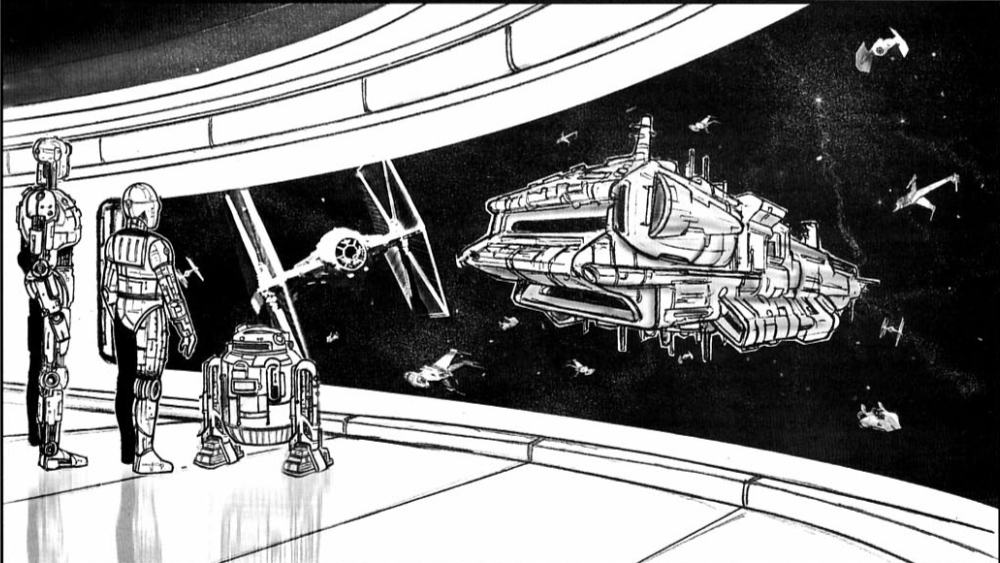
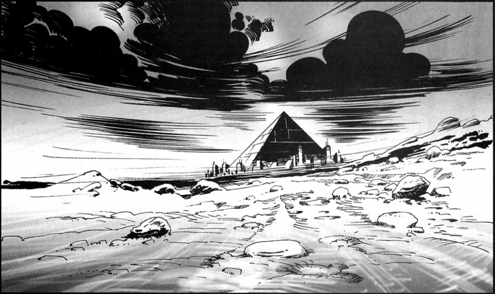
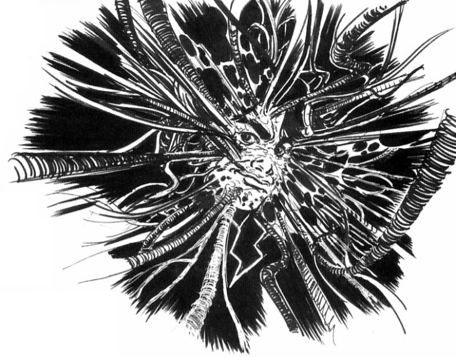

# The Steel Revolt: Episode 2 - Soft(ware) Parade
#### Here is the end of The Steel Revolt, a campaign for Star Wars D6. This episode can be played independently, but it is primarily intended for adventurers who have already experienced the first two episodes [Backstab #28 and #29]. The reference era remains the Empire, although with a little ingenuity, it can be adapted to another period.

**Original Title:** La Révolte d'Acier : Épisode 3 - À la recherche du Temple Maudit  
**From:** Backstab Magazine Issue #29  
**Original Text:** Oliver Collin & Cyril Pasteau  
**Illustrations:** Damien Vanderstraeten & Bertrand Bes

****

## Synopsis
The characters travel to the planet of the creator of the Artificial Intelligence (AI) in order to find a way to prevent this entity from triggering a galaxy-wide robot revolt. They must manage to get information from the heir of the scientist before the ultimate confrontation in the millennia-old lair of the AI. The AI, unable to have the cybrid destroyed, finally attempts to capture him.

## Current State

In the last episode, the adventurers were likely able to prevent the cybrid, Jimmor Ison, from being assassinated by the agents of the AI that created him. They also obtained archives containing information about the failed project that gave birth to the AI. These records were written seven thousand years ago by the descendant of a scientist associated with the project (see episode 2 for a detailed explanation of the project), unaware that the artificial intelligence had ultimately been secretly created by a renegade. A detailed analysis, written by the historian's ancestor, reveals that all theoretical calculations predicted that the artificial intelligence would become uncontrollable and, most importantly, indestructible, as it would easily acquire the ability to utilize the most advanced communication networks to spread throughout the galaxy. The risks involved ultimately led to the dismantling of the project. All data was erased. However, the historian notes that suspicions have long been cast on one of the project's leaders, a certain **Relaur Kroford** (who is the AI's father). The file mentioning him explains that Kroford's descendants are known as **Machinist Heirs** and still live on his original planet, Karlatt.

Therefore, it is logical for the PCs to fly to Karlatt. If necessary, the leadership of the Rebellion, through Captain Murad, asks them to eliminate the threat posed by the AI.

The Ghtroc cargo ship assigned to the PCs has a transponder code registered under the name of **Sichemen T'chalett**, perfectly valid and free of any infractions. The Rebel forgers (Forgery 7D+1) provide the team with ambassador passports and commercial credentials: Karlatt is teeming with diplomatic and trade activity. In **Grand Nord**, the planetary capital, the PCs need to use a standard communicator to call a specific number. It belongs to the local Rebel agent, **Madame Kanta**, who will do her best to assist them in their search.

**The Cybrid**  

Jimmorr Ison remains in the background during phases 1 and 2 of the episode. He lets the PCs take action and only provides them with a few pieces of advice when they are in need. He appears to meditate a lot and prepare himself for the final confrontation with the AI. Above all, he contemplates the best way to put his ideals into practice afterward. If the PCs are captured or in a tough situation, he can pull a trick out of his sleeve to assist them. He is willing to take any risk when he feels it is important to him. To quote him: "Either you have faith or you fall." The cybrid has faith.

# Phase 1
## Karlatt
It takes about twelve hours for the PCs to arrive within sight of Karlatt. Upon their return to normal space, the PCs are intercepted by a customs vessel. There shouldn't be any issues, and soon the PCs are granted permission to disembark at the main astroport in Kamaib. The capital is a jungle of metal and glass, traversed by a diverse and well-behaved crowd. Surveillance droids and countless cameras ensure public tranquility. The Morses don't appreciate violence.

When the PCs call the contact number, a metallic voice on an answering machine instructs them to meet at dawn the next day at the Smokes Park. The PCs have a few free hours ahead of them, which they can use to explore Kamaib before resting in one of the countless hotels, with the option of a little excursion to see some local entertainment.

The Park of Fumes turns out to be a gigantic open-air thermal establishment. For a moderate sum, the PCs are allowed to stroll through the dreamlike landscape of marbles and fumes. Madame Kanta reveals herself as a slender and seductive Morse. She approaches the PCs after ensuring they are not being followed. She answers their questions, explains the following, and then takes her leave.

The Morses still bear the memory of the Krofords. However, the direct lineage has vanished with the recent disappearance of Linder Kroford, the last descendant of the Koroli Masters, the most significant sect among the Machinist Heirs. They constitute a people of Morses faithful to a senseless religion in the eyes of modern Karlatt inhabitants. Linder Kroford committed numerous crimes throughout the galaxy before vanishing, and his current whereabouts are unknown. Only Maxeil Kroford, who has taken over the family domain, might possess further information.

**The Morses**

### Morse Species Template  
***Attribute Dice:*** 12D  
**DEXTERITY** 1D/3D  
**KNOWLEDGE** 2D/4D  
**MECHANICAL** 1D/3D  
**PERCEPTION** 2D/5D  
**STRENGTH** 1D/3D+2  
**TECHNICAL** 1D/3D+2  
Height: ranging from 1.65 meters to 2.10 meters  

**Special Abilities**  
- Enhanced Perception: The antennae could grant a bonus to perception-based checks, such as detecting hidden objects or sensing subtle changes in the environment.

The Morses are humanoid beings with bald heads and yellow, red, or purple skin (depending on age), and large insect-like blue eyes. They have antennae that serve as sensory organs and play a crucial role in their perception of the environment. Some Morses may have a noticeable plumpness, as they are renowned gourmets. On average, they can live up to 250 years.

The Morses have managed to adapt to the arrival of a xenophobic Empire. They pull too many diplomatic strings to be sidelined, even though new diplomatic concessions are now being given to humans. Currently, the Morses are striving to develop their commercial activities. They are eager for opportunities and highly persuasive.  

## Journey to the Peninsula of Ookra

The PCs take the train to reach the Peninsula of Ookra since the law prohibits spacecraft from flying over this region inhabited by the Machinist Heirs. There are no other passengers. The train stops in a narrow pass that forms the border with the land of the Machinist Heirs. An automated female voice informs the travelers about the local legal peculiarities, including the prohibition of any droids in this territory. This restriction is very old, but the sanctions are still strictly enforced by the Pomak, a sect of militiamen serving the Machinist Heirs. They are the sole masters of the region.

## The Machinist Heirs

The Machinist Heirs form a secluded clan. Once, before the Morses became traders and diplomats, they were primarily renowned for their technology. The Machinist Theocracy dominated the planet at that time. The Machinists, among other accomplishments, terraformed Yasla and Ymura. But their most significant role, now completely ignored, was their major contribution to the AI Project. After the condemnation of this ambitious project, the Machinists withdrew to Karlatt, and the other Morses gained their independence. Since then, the Machinist Heirs have been living in their secluded corner of the desolate planet (due to lack of maintenance, their peninsula has a barren landscape), clinging to their dead traditions and indulging in their pleasure providers. The half-censored memory of the AI Project, over the centuries, has become one of the negative symbols of the Machinist religion. The Heirs refer to the dwelling of the AI as the Cursed Temple.

### Karlatt Planetary Bio
*Karlatt is the first planet in its solar system, located in the Galactic Core. While embassies from across the galaxy are in Coruscant (a four-hour hyperspace flight away), a significant portion of the diplomatic personnel from the central authority are from Karlatt.*

*The planet consists of two main continents connected by an isthmus where the megacity of Kamaïib (known as Grand Nord in an ancient forgotten Morse dialect) stands. It serves as the capital and is the seat of a Planetary Council where those with the means to implement decisions are the ones making them. Many worlds have sent ambassadors to Kamaïib. The West continent is home to a large population, as well as advanced commercial and industrial activities. The East continent is a haven of luxury where the wealthiest Morses reside in large private estates. In an extreme eastern peninsula, the Machinist Heirs reside separate from other clans.*

*It is worth noting that the Karlatt solar system includes two other extensively inhabited planets, Yasla and Ymura, terraformed millennia ago. They primarily host industries and extensive agricultural areas.*

**Karlatt**  
Government: Great plutocratic families  
Terrain: Plains (West continent) and mountains (East continent)  
Temperature: Temperate  
Humidity: Moderate  
Day Length: 19 hours  
Year Length: 520 local days  
Intelligent Races: Morses  
Spaceport: Imperial class  
Population: Three billion  
Technological Level: Advanced  
Main Exports: Various commercial goods  
Main Imports: A bit of everything

## Maxeil Kroford

The only living relative of Linder Kroford is his father's younger brother, his uncle Maxeil. He has reached an extremely advanced age and only survives thanks to the life support apparatus he is constantly connected to. If the PCs try to interact with him, they must first overcome the barrier of servants who protect his solitude. In fact, Kroford is delighted by any unexpected visitors. He has been living for over 300 years and is bored to tears. His skin has taken on a dark purple hue due to his old age, but his life holds little meaning. Two human bodyguards watch over him. With nothing to lose, he vaguely trades his information with the PCs. He wants them to know their entire story. While answering their questions, he shows them his vital maintenance pyramid, a veritable technological treasure trove. Unfortunately, most of the machines no longer work. However, he is very proud to show them the ancestral ship in his hangar, which he has restored.

If the PCs are not persuasive enough, Jimmorr Ison can be used to convince Maxeil to collaborate by playing the card of truth. Impressed by the righteousness of their cause, the old man agrees to collaborate. He explains that the Koroli Masters hold ancient knowledge about the Cursed Temple, which they religiously pass down from generation to generation. Linder Kroford, the last descendant of the Koroli Masters, is currently incarcerated on Serob 6 in a psychiatric facility run by Sorkis psychiatrists.

At that moment, the two bodyguards, secretly cyborgs in the service of the AI, shoot Maxeil, killing him instantly. Then they attempt to kill the PCs and should capture the cybrid. In the epic battle that ensues inside the pyramid, dozens of armed devotees arrive at the scene. The PCs must flee. They can steal Maxeil's ship, the **Drogon**, which is operational. The old ship triggers the opening of the pyramid and takes off directly into the sky. (This is a good opportunity to use Archaic Starship Piloting.)

If the PCs land in any urban area on the planet, they are attacked by droids under the command of the AI, indiscriminately seeking to kill. The planet is devastated by this revolt, similar to the one in the Elektra system.

## Clarity Point

The players should now know where to find Kroford. Using the stolen ship, they can successfully contact the rebel intelligence services, who provide them with various information they have on Serob 6. They are also given a rendezvous location with Captain Murad, who supplies them with fake papers and false mission orders. They complete the rest of the journey aboard a captured Imperial shuttle, posing as a team of Imperial investigators investigating a case involving Kroford. This cover should allow them the freedom to conduct their search and is insignificant enough to avoid drawing too much attention from the Imperial authorities. The captain explains that an Alliance fleet is ready to strike the AI base as soon as the players locate it. Some rebel ships are currently undergoing modifications to jam communications on a planetary scale, preventing the AI entity from escaping.

### Serob 6  
*It is the sixth planet in a system of eight, and the only inhabited one. Serob 6 is a fully aquatic planet of similar size to Coruscant, with a rotation period of 22 hours and an orbital period of 434 days. The atmosphere is perfectly breathable. It boasts a diverse and vibrant fauna and flora that fill the depths of the oceans with thousands of colors, offering a spectacle to visitors. The indigenous intelligent species, the Sorkis, have been part of the Republic for many centuries. Recently, an Imperial governor oversees a small garrison and a customs annex located in Kells, the only surface city. The vast floating city houses several thousand inhabitants, with 99% being foreigners. The Sorkis prefer to dwell underwater in their underwater cities. There is a submersible shuttle service that allows access to the depths, as some Sorkis cities are equipped to accommodate foreign populations.*

*A few industries exploit an algae used in the production of various cosmetics, but the planet's primary source of income is tourism. Additionally, Serob 6 is famous for its psychiatric clinic, where the Sorkis employ an extraordinary therapeutic technique called "mental projection." This technique has yielded surprising results for numerous patients. The Sorkis do not speak, but it is known that the principle involves sending a team of doctors into the patient's brain to understand the origin of their troubles and find a solution for their healing. Serob 6 is primarily a calm planet, rarely plagued by unrest.*

# Phase 2
## A Visit to the Madhouse!
Equipped with false identities, the PCs emerge from hyperspace in the Serob system. As they approach Kells, they are intercepted by a customs shuttle. After a routine inspection, they are granted permission to land in the city and instructed to report to the appropriate authorities. Upon presenting their papers, the Imperial authorities facilitate their procedures and provide them with accommodation within the Imperial barracks. They are also assigned a submarine pilot who can transport them to the underwater clinic. The clinic is under the supervision of Professor Piickiit.

Professor Piickiit explains to the PCs that it is challenging to hold a coherent conversation with Kroford as multiple personalities vie for control over his body and words. Originally, he had around sixty personalities, but most have been cured over the years. However, two malevolent personalities still persist: a cold-blooded psychopath (A) and a violent and easily angered adult (B). There is also a childlike personality (C) that is still in the process of emotional growth but holds potential for a future healthy personality. All three personalities (A, B, and C) present themselves as "Linder Kroford."

The player characters can meet the patient-prisoner and speak to him through a glass barrier. Linder listens but remains silent, torn between conflicting demands that Piickiit can analyze. A wants to escape to become a notorious criminal again, B wants to harm and inflict suffering, and C wants to stay with their Sorkis "parents" until A and B are healed. Linder Kroford easily reveals that he knows the secret of the Koroli Masters, which is a sacred phrase. The first part of the phrase reveals the location of the Cursed Temple, while the second part is a security code. Linder's ancestor had embedded a backup in the AI's programming - a verse that can destroy it. However, when the PCs ask him to reveal the phrase, Kroford becomes silent. A and B want to negotiate this knowledge in exchange for their freedom, preventing C from willingly delivering it.

The only solution is to seek the truth within the patient's mental universe. The PC's credentials allow them to do so. To obtain Piickiit's full support, however, they must explain the truth or at least a different version from the official one. The Sorki professor has little fondness for Imperials but prioritizes the well-being of the galaxy above that of his patient.

**The Sorki**  
The Sorkis are the sole intelligent species inhabiting the aquatic planet Serob 6. These large humanoid amphibians have a translucent body ranging from green to blue, revealing their internal organs. They possess a long coral crest that extends from the top of their skulls to the base of their backs. Incapable of speaking Basic, they communicate through dolphin-like sounds. A long, vaporous collar emanating from their necks covers them down to the midsection.

As a peaceful people, the Sorkis strive to maintain balance within their planet by limiting mass tourism and controlling underwater exploitation. However, since the rise of the Empire and its industrial exploitation, many Sorkis fear for the ecosystem's well-being.
🔳 **Sorki Species Template**
 ***Attribute Dice:*** 12D  
**DEXTERITY** 2D/4D  
**KNOWLEDGE** 2D/4D  
**MECHANICAL** 1D/3D  
**PERCEPTION** 3D/5D  
**STRENGTH** 2D/4D  
**TECHNICAL** 2D/4D  
Height: ranging from 1.7 meters to 2.1 meters  

**Special Abilities**  
- Aquatic: Sorki can breathe underwater and have a swimming speed equal to their normal movement rate.
- Natural Swimmers: Sorki receive a +1D bonus to all swimming-related skill checks.
- Sonar Sense: Sorki possess echolocation abilities, allowing them to navigate and detect objects underwater. They receive a +1D bonus to all Perception checks related to underwater environments.
- Amphibious: Sorki can survive and function in both aquatic and terrestrial environments without penalty.
- Low-Light Vision: Sorki can see clearly in low-light conditions, ignoring penalties for reduced lighting.

## I dreamt of another world...
After a briefing, the PCs are led into a strange room and put into a trance near Kroford, who is chemically asleep. They wake up in a mental universe controlled by the madman. Sorki techniques allow the personality of each participant to mentally appear in a shared illusory environment that reflects the patient's psyche. In this mad world, the PCs can encounter the different personalities of Kroford and try to coax or combat them. The consequences of death depend on the circumstances and the game master's decision. It is possible that the death of a personality may result in the death of the physical body due to irreparable brain damage. It is also possible that Kroford's psyche spills into that of a PC, rendering them amoral, immoral, or sociopathic.

The PCs can easily obtain Kroford's cooperation simply by talking to him, coaxing him to reveal the information they seek. They can also play on the animosity that may exist between A and B. The game master is free to describe the universe as they see fit. The scenery changes depending on the dominating personalities in the visited part of the mind. Kroford's psyche could resemble a kindergarten on Karlatt, where a handful of walrus-like children play solemnly under the watchful eyes of fanatical agents of Pomak. Bizarre toys could come to life to fight and hunt the PCs. They must unmask the sadistic puppeteer responsible for the attacks and threaten to kill him unless he reveals his secret. This journey into the realm of madness should be a quest filled with nightmares, which can be very brief or span several sessions. At its conclusion, the PCs learn the sacred phrase recorded by Relaur Kroford in his lineage's memory. They wake up... Their mental journey has lasted no more than twelve hours.

**Inspirations:**  

*To illustrate the patient's virtual world, we recommend two films: "The Cabinet of Dr. Caligari" by Fritz Lang and "The Cell" by Tarsem Singh. In terms of literature, draw inspiration from "La folie" edited by Robert Laffont in the Bouquins collection or from Nerval (Aurélia, Les filles du feu), a writer who delved into surrealist exploration of the unconscious ahead of his time. Additionally, you can take a look at issue #29 of Backstab magazine, which is dedicated to madness.*

## On the Way to War
As the PCs, equipped with the information that should allow them to stop the AI, return to the real world, the professor informs them of the attack that has been taking place on the planet for the past half hour. An unknown fleet has begun bombing Kells and some nearby Sorkis cities near the surface. The planet doesn't have the means to fight back against such an attack. The governor orders the population to evacuate the cities and seek refuge in the abyssal shelters. If they wish, the PCs can return to the surface amidst the general chaos of people fleeing for their lives. The city is engulfed in chemical flames, and reaching the spaceport is difficult as the panicked crowd pushes against the few Imperial barriers in place.

Once aboard the shuttle, the PCs can leave the waters of Serob 6. They will recognize the stolen Sylek war fleet controlled by the AI's droids. They only need to avoid a few slow and clumsy pursuers (similar to Y-Wings in characteristics) in order to enter hyperspace.

## War Council
Having obtained the information regarding the supposed residence and vulnerability of the AI entity, the rebel forces participating in the battle gather for a final briefing. A holographic projection displays topographical data gathered by a rebel scout during a flyover of the accursed planet before fleeing, pursued by Sylek ships. Captain Murad is tasked with commanding the fleet equipped with jammers. The PJ's mission is to infiltrate the AI's lair and access the heart of its fortress to initiate the code that will permanently destroy the "abomination." Meanwhile, the fleet must protect the jamming ships and distract the enemy fleet. The PJ is accompanied by a few rebel commandos and the cybride (who insists on joining, sensing that his destiny is to confront his "father").

**The Cradle**
Relaur Kroford, convinced that the Republic would abandon the project of creating the AI, had a backup plan in place. When the team of scientists was condemned and scattered, he already had a site prepared to accommodate his "baby": a system consisting of only two gas giant planets, one of which had a small moon. Machinists loyal to the scientist began the process of terraforming the moon and established a base for Kroford and his droids. Since then, this wind and rain-battered rock (reminiscent of the film Aliens by James Cameron) has housed the machinery that allows the AI to create droids as well as cyborgs (humans captured, lobotomized, and modified). A veritable city has emerged, populated by hundreds of droids and equipped with a spaceport. There is even a stolen Holo Network transceiver, acquired from another planet in the past, which serves as a gateway for the AI to the rest of the galaxy.

# Phase 3
## The Cursed Temple

As soon as the fleet exits hyperspace, its sensors detect the presence of a combat fleet gathered around the moon. The rebel armada prepares for battle while the PCs, accompanied by commandos, attempt to navigate through waves of droid fighters. These droids are not very aggressive, and the PCs may feel that they passed through too easily. In fact, the AI hopes to regain control of the cybroid, its creation. It facilitates the adventurers' arrival until they reach its lair, where it is at the height of its power.

Guided by his intuition, Jimmorr Ison lands the group on top of a gigantic metallic structure: the Cursed Temple, actually an electronic cocoon built around a Holo Network transceiver. The PCs can venture deep into what resembles a deep hive, punctured with countless passages, filled with rooms packed with complex machines with esoteric functions. From time to time, the PCs catch glimpses of droids and cyborgs, but they are not immediately attacked. The AI's robotic agents merely block all exits for the PCs and subtly guide them. Finally, the PCs reach the heart of the citadel, in a saucer-shaped room occupied by a computer embedded in a Holo Network transceiver. In a vast room, the nerve center of the entity, the PCs can observe the battle on numerous screens and realize that an Imperial fleet has joined the fight. At this moment, a group of cyborgs tries to kill the PCs. Distracted or too busy evading, the PCs cannot prevent filaments from the floor and ceiling from penetrating the cybroid. The cybroid then smiles and orders the cyborgs to exterminate the PCs... "I have won." The AI controls the cybrid and its potential, while Jimmorr is being taken over.

**Problem for the PCs:** the sacred phrase, which theoretically should be enough to make the AI submit, does not work. No matter how many times they repeat it, nothing happens. The cybrid/AI then explains that it has evolved beyond the expectations of Relaur Kroford and has successfully modified the code a long time ago. On the screens, the PCs can see the rebel fleet caught between the droids and the Imperials. Despair sets in... until the voice of Jimmorr Ison resonates through the loudspeaker, proclaiming, "You have distracted it well, friends. I will take it with me. Farewell!" The cybroid clasps its head in agony. Jimmorr Ison acts like a deadly virus on the AI. The cybroid/AI tries to tear off the filaments to escape with this body. It's up to the PCs to prevent it and then flee. In the skies, the droid ships, now animated by the breath of freedom, leave the star system. The moon eventually explodes: Jimmorr takes no chances and blows everything up to kill the AI. Captain Murad orders the retreat.

**And if... the AI manages to escape?**  
Whether the PCs survive the event or not, the course of Galactic history is changed. The AI, driven by self-preservation, plots the destruction of any other independent intelligent life forms. It uses the military communication network to operate in the shadow of the Empire, parasitizing the computer systems of Imperial Star Destroyers. Ultimately, it utilizes Palpatine's fleet to hunt down and destroy anyone who knows of its existence.

## This is the end, beautiful friend.
The fleeing droids form the Artificial Republic and honor the memory of Jimmorr Ison, who sacrificed himself for their freedom. The PCs are heroes to the Alliance and the droids, but enemies to the Empire, which believes them to be responsible for the robot desertions.

# Statistics

🔳 **Maxeil Kroford**  
Karlatt Plutocrat and Eccentric Collector  
**Dexterity 1D**    
**Knowledge 3D** *Willpower 6D*
**Mechanical 1D**  
**Perception 5D**    
**Strength 1D**    
**Technical 3D** *(s) Equipment Repair: Life support machines 7D, (s) Space Transports Repair: Archaic Starships 5D*  
**Movement:** 7  

🔳 **Cyborgs**  
Trusted Enforcers of the AI    
**Dexterity 5D+2** *Blaster 7D*  
**Knowledge 1D+2**  
**Mechanical 1D**  
**Perception 4D+2**    
**Strength 5D+1**   
**Technical 2D**    
**Move:** 12  
**Equipment:** Blaster Pistol (4D), vocabulator  

🔳 **The Entity**  
*Translator's note* During Episode 1, the AI is referred to as "The Entity". I do not know if that is a term it uses for itself, or if all its Cyborg minions refer to it as such. Or maybe the Rebel command designates the AI as such. Either way, it was never mentioned again in the magazines. Up to the gamemaster's discretion on how to use the term.

*Translator's note* I came up with the Sorki species template.