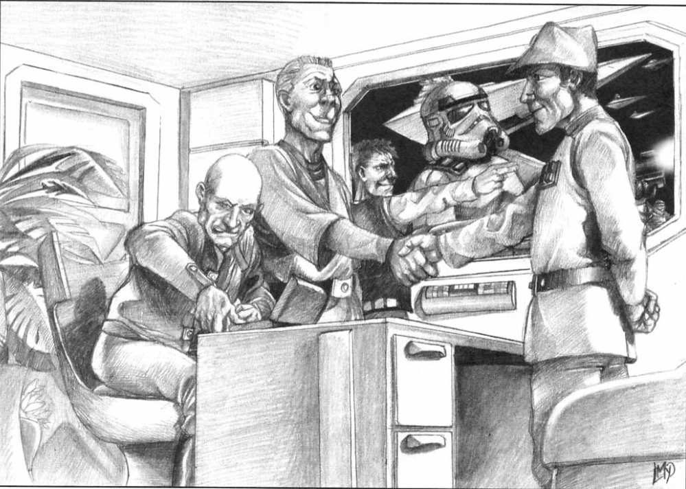
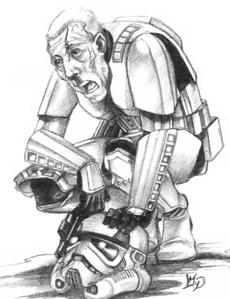

# Stars, Beware! In Young Idealists, Competition Breeds Fanaticism.
#### This adventure takes place during the era of the Rebellion, but with a twist—you are not the heroes. In this story, the players take on the role of Stormtroopers, the elite shock troops of the Empire. You serve the will of the Emperor, uphold order, and crush dissent.

This scenario delves into the harsh reality of totalitarianism. It is not a lighthearted tale, nor one of noble rebellion. It is a story about obedience, indoctrination, and the cost of unquestioning loyalty.

Consider this your content warning. This adventure does not shy away from the brutality of the Dark Side. It is not politically correct, nor does it seek to glorify its subject matter. Instead, it offers a glimpse into the machinery of oppression—and the choices one makes within it.

Are you ready to see the Empire from the inside?

**Original Title:** Etoiles, gardez-vous!... ...des jeunes gens idéalistes qui aiment rtop el sport.  
**From:** Backstab Magazine Issue #33  
**Original Author:** Cyril Pasteau 
**Reviewers:** Mehdi and Sylvain T.
**Illustrations:** Laurent Miny

****

## Synopsis
Recruited by the Empire, the player characters (PCs) attempt to survive basic training into the elite Storm Trooper forces. This can involve unspeakable acts: participating in genocide, betraying your friends. But loyalty to the Emperor comes before all other considerations, doesn't it?

## The Player Characters' Backgrounds

This scenario can be played by very different types of characters. Nothing prohibits the gamemaster from authorizing a mixture of personas, but it must be understood that for some characters (like the Spy), character death is a high possibility. In any case, in the event of a group with shared non-Imperial characters, any Rebels will have to keep secret their real identity. In the training camp are mixed all types of characters.

Players all play as physically fit humans (and at least 1.80 meters tall) who entered an office recruitment of the army or the Compnor with the stated intention
to join the army of the New Order. There they are subject to tests which took the form of questionnaires, psychological probes, and role-playing evaluations. If you want, ask them questions inquisitive and perverse, involving making difficult choices
between loyalty and self-interest. Then the psychological profile is entered into a computer by the non-commissioned officer in charge of recruitment, and a droid analyzes all the parameters before establishing a list of careers to which the candidate can apply.   

The player characters have been assembled and assigned into the most prestigious of all (aside from the Imperial Pilots Corps, of course): They are to be Stormtroopers. The elite shock arm of the Emperor.  

The characters should be made to prefer this career to others, regardless of it removing any contact with their former families. The prestige of the shock soldiers is collective, and not individual. The corps are their new family, and for the jingoistic masses of the Imperial Core, dedicated to their genetic superiority, these elite troops are the power
that they don't have in their everyday lives. For the rest of the Galaxy, shock troopers are a symbol of terror.

**A - The Volunteer** 

The Volunteer probably knows other troopers, know of each other, or hail from a shared sector of space even if they don't know each other. They are always grouped together by geographic region, for a reason explained later in the scenario. They probably belong mainly to low or low-middle socio-economic classes of societies of the Imperial Core. Their take on life as a shock trooper can be realistic (it's butchery, but it's prestigious) or more idealist (the shock soldier is the first line of defense of the New Order). Typically, the recruit is a sports fan, and supports Darwinian views on life in general (the the best win, the weak are crushed); he thinks it's better to be the fist of the Empire than to rot in its depths, or in the mediocrity of its cities where social mobility does not exist.  

In game terms, the Volunteer gains an additional contact (REUP page 30) that they can call upon during the campaign. 

**B - Forced Recruit**  

Shock trooper training is supposed to make anyone loyal. It therefore does not matter what the recruit's initial opinion on the New Order. From the moment a recruit is vigorously pressed through the grinder of the Imperial Training process, they can come out a brainwashed shock soldier. The recruiting sergeants who abduct humans to fill their quotas only do so in specific populations: Imperial Core prisons or worlds far from the heart of the Empire.

In game terms, the Forced Recruit gains the Fanatic disadvantage. They gain +1D to assign at character creation but will defend the ideals of the New Order, even trading their life for the ideal.

**C - Demoted Imperial**  
Some veterans (young or old) of the Imperial army and fleet officials are traumatized by certain events of the Galactic Civil War. They could feel like they have lost their souls, and slip further and further into depression. Instead of more drastic means, they can be identified for "reintegration" or "retraining" by their superiors. These are forced to join the shock troops, a lifeline to restore meaning to their lives. Often, it is the soldier's former comrades, underlings who want his job, or his fed-up superiors who recommend the "retraining", to get rid of this depressed individual.

In game terms, the Demoted Imperial gains either the Manic Depressive, Nightmares, Addiction, or Low Self Esteem disadvantage. They gain +1D to assign at character creation but must adhere to their chosen disadvantage. 

**D - Spies**

If playing evil characters isn't your thing, it's possible to have spies play out this scenario. The Rebellion attempts a very big blow, and wants to infiltrate a division of Stormtroopers with agents capable of resisting mental conditioning. This is an extremely risky infiltration mission, which involves gathering as much information as possible about training, recruitment, and the life of Stormtroopers, in order to discover a means of
counter them. But there is no question of recruiting suicidal people for this
type of operation. On the contrary, you need the cream of the crop: Alliance Specforces

The risk of being caught is so great that the Player Characters are equipped with a suicide pill to prevent capture and discovery. Furthermore, they are often
put to an intensive hypnotism which buried deep within them
their memories of the Rebellion. In game terms, characters with this background gain an additional +2D to Willpower rolls. During the scenario, each failed willpower roll puts the character at risk of discovery.

### Solitude of the Soldier
Your goal, as a gamemaster, is to be the bad cop. You are the authority these troopers deal with in their lives. Roll your dice in secret. Make them fear you. The players must usually show themselves to be clever and enterprising to succeed in an adventure: coming up with a plan with their friends, understanding when to take risks, et cetera. 

**Here all of this is secondary.** Depending on how your players approach the scenario, they must become the perfect servant of the Order. Individuals are not tolerated in the totalitarian society in which they participate.  

For this reason, during the scenario, the PCs are mentioned in the singular. They can cross paths, but barely speak to each other and above all not to support each other. They are suffocated by the mass, they are separated from their friends and families by incredible physical or psychological challenges. Avoid addressing the players collectively (Not: What do you all do? But rather: Trooper One, what do you do?), unless  they really manage to meet secretly. Make them select their character names, then erase their names and issue them Identification numbers like TK-123 or ST-528. Any coordination out of character must be squashed, and then they are to be issued push-ups, laps, or jumping jacks. They must feel alone in the face of authority.  

## The Training System
During each phase of training, the PC must spend two tests. Bad luck on the dice means almost certain death, since failure in both tests represents rejection during section A. Failure on a single roll means rejection in section B. But the unlucky PCs can keep their lives by proving their loyalty to the Emperor. To do this, they must commit atrocious acts.

Instructors award **Loyalty points**, which they record on a large board in the middle of the camp. You need 3 Loyalty points to move from section B to section A. A fierce
competition reigns within section B to obtain the promotions in section A.

## The Protagonists (Antagonists?)

**The Base Commander**  
Shock troops do not include officers. They are always placed under the responsibility of army officers or the Imperial Navy. The relationship between officers and Stormtroopers is complex. The obedience of the soldiers is total--but the contempt is mutual. For officers, soldiers are animals that must be taken to the slaughterhouse. For the ground troops, the officers are servants of the Emperor; they therefore must be respected. But the soldiers nevertheless know that they are much closer to the black heart of the Emperor that the officers lost in their tactical plans.

Use the characteristics of the Typical Imperial Army Soldier -
and add Bureaucracy 4D, Command 6D, Scholar (military tactics) 3D, Intimidation 4D, and Tactics 6D

**Typical Drill Sergeant**

Sergeants are shock troop veterans. They don't have more personality, but they are very tough. At the stage where they are, they would be completely unsuitable for civilian life. They would simply not know what to do: they would stay stand on alert and wait for orders. In a camp training on the other hand, they are everywhere at once, and they deploy treasures of efficiency to flush out the unsuitable or slackers. They are the perfect cogs of the great imperial war machine.

Use the characteristics of the Typical Imperial Shock Trooper, but add Command (Imperial Recruits) 4D, Intimidation 4D, Tactics 3D.

**Non-Player Typical Recruits**

Use the characteristics of the average Stormtrooper, but subtract -2 from all rolls while in Training Phase One and Training Phase Two, and -1 from all rolls while in Training Phase Three. 

**Loyalty Points**
- Not showing emotion while committing a murder: +1 point.
- Obeying an order to harm oneself: +1 point.
- Complete twice the objectives set for the day by an instructor: +1 point.
- Resist blows without flinching: +1 point.
- Kill a roommate placed in custody by an instructor: +1 point.

## Training Phase One - Recruitment (Two Weeks)

It doesn't matter where it takes place, But from the moment the player character signs up for the Stormtrooper corps, they have to say goodbye to their family, aquantences, and embark a military shuttle full of recruits like themselves. They depart for camp, making frequent other stops, picking up passengers, and resuming its journey. The player cannot see anything. 

They are isolated in a cell, only wears imperial undergarments, and must destroy their previous effects and clothes. He is fed a foul stew, through a peephole. During the trip, droids put each player through a battery of medical, physiological and demanding psychological tests. Furthermore, each soldier is implanted with a subdermal chip in the back of his neck. This chip allows the imperial hierarchy to locate the soldier, and
to detonate Imperial property at any time. This device She is endowed
a self-destruct device that is difficult to defuse by electricity
technician/neurosurgeon who would risk it (difficulty 35). The PJ
learns of its existence by chance, noticing a badly scarred
closed on a recruit who has just undergone implantation.

Suggested Difficulties to occur during this stage:  
- Willpower roll difficulty 8 and Stamina roll difficulty 8.
Failing the Stamina roll places a trooper in a diminished state, resulting in -1D to rolls. The effects persist throughout Training Phase Two.

**Imperial saying:** “The last choice made by a Stormtrooper is to become a Stormtrooper. Afterwards, he just obeys."  

## Training Phase Two - Building the Base (One Week)
Eventually, the troop transport stops in orbit a beautiful blue and green planet. The recruits are divided into three groups. The first is called **Alpha Section** and is made up of all those who have succeeded in both rolls of Training Phase One. The second is called **Bravo Section** and is made up of those who failed one of the rolls, and who therefore have showed signs of weakness. The third is called **Gamma Section**. This third section is made of those who have already broken down mentally and physically
only (the two failed throws). 

The three sections are successively dropped by shuttles onto the planet 
descended by shuttles onto the planet ("The Planet" is never mentioned by name, but a player with good enough Perception might overhear the phrase "Operation Tigerpalm"). Thousands of recruits land, and are organzied into squads of fifty. After the forced isolation of the journey, the future soldiers relax, laugh a little and get to know each other for those who were unaware of each other. 

Finally, the shuttle doors open and the recruits find themselves in the middle of a gigantic bare plain, in front of large containers filled with equipment. The hundreds of drill sergeants make them stand to attention. The commander walks past them without looking at them. It is the end of the night, it's cold and everyone is freezing, except the commander and the instructors who are in Stormtrooper armor (they are the only ones).

Each recruit is ordered to take a spade and start digging. The instructors instruct the troopers to build an Imperial base. All the necessary equipment is located in the containers. The ground is muddy from recent rain. The base is planned to be the size of a large city, and its construction therefore takes a long, strenuous week with the means to build heavy duty facilities made available to the troops.

Suggested Difficulties to occur during this stage:  
Lifting and Stamina difficulty 8.

**A sergeant at three in the morning:** “Get up, you bunch of woodlice! The Emperor wants you to stand up!”

### There are many like it but this Armor is mine.

Once the base is built, the equipment are distributed in the different squads. Recruits from Gamma and Bravo section remain in pajamas. Those in Alpha section are assigned a  blaster rifle and Stormtrooper armor in stewardship. This is the white armor which inspires terror in the whole Galaxy.

The instructors make ig clear to the recruits that "This Armor is their life"", and their life consists of serving the Emperor. Those who are rejected from the Alpha section must surrender their armor, and those who are admitted into Alpha Section are assigned armor which they cherish above all else.

If the players pays attention to this, in the rare moments when they can see the faces of their fellow recruits, the armor changes their fellow soldiers into impassive, inexpressive killers who do not want to lose their armor.

### Alpha Barracks

This is the central district, where those deemed capable live to make good Stormtroopers. In the middle is the landing pad and parade grounds. On it stands a shuttle with a pilot. 

The instructors explain that the members of Alpha section who wish to leave and return home may do so. All they need to do is take their armor off. No one takes them up on it. Those who do, are never heard from again (they are shipped off to be guinea pigs in Imperial biology experiments.) The shuttle constitutes another test, but it is far too late to give up the career of Stormtrooper.  

During the three months that the training lasts, only a handful ever choose the shuttle.  

The soldiers live in tents and are properly fed.

### Bravo Ring

Bravo section barracks exist in a ring which surrounds Alpha Barracks. It is surrounded by electroshock fence and barbed wire. It is the home of soldiers on probation, who have until the end of training to earn their armor and join Alpha section.

Soldiers live in tents and are fed slop and rotten stew.

### Gamma Zone

Everyone else has the largest tract of land: the rest of the planet. Gamma soldiers must find food themselves (difficult survival rolls). They must also build shelter themselves, which constantly comes under attack from other groups of Gamma soldiers. They officially still have the possibility to return to Bravo, but few ever do.

Once a day, a sergeant instructor authorizes a member of Gamma squad to join the
section Bravo. Competition is fierce, and there are many killings to stand in front of the instructor in the hope of being chosen. The men throw themselves at each other to eliminate competition. They fight with fist and die in the mud. 

### The Planet

Operation Tigerspalm operates on a standard, unnamed planet and is used for Imperial training. It has a breathable atmosphere, thirty-hour days, and includes a diversity of
very pronounced climates: jungle, desert, plain, mountain, sea, et cetera.

There are humanoids native to the planet are equipped with pre-space technology, and are frequently hunted for training purposes. If the Rebel Alliance ever learns of its existence, and the atrocities taking place there, they would certainly act to
help the locals flee their homeland or fight off the Empire.

### The Infirmary

The on-duty medic is a Stormtrooper known—though never to his face—as Lips on Fire. His reputation comes from a sadistic habit: any trooper foolish enough to remove their helmet in his presence risks having a burning ember shoved into their mouth. Should a Player find themselves in the infirmary, they’d best hope they pass whatever test he deems necessary—failing means more than just a lesson in discipline; it means suffering a Wound.

## Training Phase Three - The destruction of the individual. Mental and Physical training (Six weeks)

Phase 3 – The Destruction of the Individual, Mental and Physical Conditioning (6 Weeks)

After the grueling physical ordeal of base construction, the Player Characters must adapt to an unbearable routine. Each day consists of:
 - One hour to eat
 - One hour of classroom study
 - Fourteen hours of field training
 - Six hours of propaganda indoctrination and “mental fortification”
 - Six hours of sleep
 - One hour for various activities (hygiene)

There is no leisure, nor any privacy. The drill sergeants wield absolute authority and do not hesitate to exercise it. They mercilessly beat underperforming recruits with stun batons. If a victim loses consciousness, they intensify their assault for an additional 1d6 rounds before ordering passing soldiers to carry the injured to the infirmary.

Generally, displaying ruthless aggression toward one’s assailants is enough to make them back off. However, any sign of individualism is immediately reported by the shock troops and swiftly punished by the instructors with blows to the head.

You may incorporate key moments of hardship for each PC to endure.

### a - Raise Your Hand

An instructor explains to the section that he is in charge of the morning exercises. The inefficiency of the method he presents is obvious. He then asks if anyone has a better idea for how the exercises should be conducted. If the Player Character (PC) speaks up, they receive a beating.

Repeatedly, the sergeants conduct similar tests to eliminate any trace of independent thought among the recruits. They also condition them not to question why they must follow orders—demonstrated through pointless tasks like digging holes only to fill them back in.

### b - New Name

After breaking down their personalities, the instructors reshape the recruits’ minds. Soldiers undergo hypnotic indoctrination sessions. The use of unnecessary words (anything outside of strict military vocabulary) is forbidden.

The PC is told that their old name no longer matters. From now on, they must respond to an alphanumeric code, such as XB-Z37 of Section 654-10. Their left-hand bunkmate is XBZ-36, and their right-hand bunkmate is XBZ-38. They are forbidden from sharing their birth name with fellow recruits. Even non-commissioned officers and commanders have no personal names—only their titles (sergeant or commander) are used.

### c - Scapegoat

An instructor or the PC’s bunkmates decide that they don’t like them. As a result, the PC is beaten with stun batons or fists.

They might also suffer underhanded sabotage—such as having their bedding undone at the worst moment, which is considered a sign of negligence and, therefore, disloyalty.

### d - Stand Up for the Emperor

Every morning, the last soldier to leave the barracks is executed by an instructor.

The PC is vigilant enough to avoid being the last one out, but what happens if a bunkmate knocks them out during the night? Or if, in the chaos, someone shoves them just long enough to delay them by a few crucial seconds?

A few brief exchanges of punches, a desperate sprint for the exit… The last one out is shot!

### e - The Deadly Obstacle Course

The PC must navigate a series of obstacles, barriers, pools, mud pits filled with mines, and razor-wire fences. Think Fort Boyard, but lethal.

### f - Journey to the Edge of Night

All recruits in Section A are woken at 1:00 AM and must stand at attention, fully armored, outside the barracks.

Ten minutes pass. Then an hour… It is not until four hours later that they are allowed to return inside. The first to collapse is executed.

Tests: The PC must pass a Willpower roll (Target difficulty 8) and a Stamina roll save (Target difficulty 8). Failing the Stamina roll means they gain a wound that lasts throughout Phase 4.

**Storm Trooper Creed:** “We are the mud. Only the Emperor’s will matters. It is not we who define ourselves—our uniform does. We are the anonymous servants of the New Order.”

## Training Phase Four - The destruction of the individual. Mental and Physical training (Six weeks) - The Final Trials (5 Weeks)

The last phase of training consists of a series of tests designed to ensure that the soldiers are willing to do anything in service of the Emperor. At this stage, only about twenty thousand soldiers remain in Section Alpha. Section Bravo consists of approximately sixty thousand recruits, while Section Gamma contains just a few thousand scattered survivors. The rest are dead.

### a - The Final Roll Call of Section Bravo

The drill sergeants gather the members of Section Bravo according to their home regions and cities. The members of Section Alpha who come from the same regions are ordered to execute them with rifle butts. It is a large-scale massacre, but the members of Section Bravo are resigned to their fate.

### b - The Grand Training

After killing their former comrades in Section Bravo, the soldiers of Section Alpha must eliminate the survivors of Section Gamma. Those gathered at the camp gates are slaughtered quickly, but those who have fled into the distance must be hunted down.

### c - The Genocide

Now fully trained, the shock troops are armed, grouped into small squads, and ordered to exterminate all life within a thousand-kilometer radius. The Player Characters must march toward a city inhabited by the planet’s natives and take part in the massacre. The instructors ensure that the soldiers remain aggressive, and at this stage, any recruit who appears too soft can still be eliminated.

### d - The Visit

The surviving trainees stand at attention to welcome an envoy of the Emperor, who has come to inspect the new recruits. The envoy walks past thousands of men standing in formation across the devastated plain before stopping in front of Section Alpha. He delivers his instructions, which are relayed by a sergeant with fists of steel.

All members of the section are ordered to move within ten centimeters of each other, leaving only a narrow path for the visitor to pass through. As the Emperor’s envoy walks between the soldiers, he focuses intently. He has the ability to Sense the Force, and rolls 5D to detect any force-sensitive members.

If a Player Character is Force-sensitive, they risk being detected. If discovered, they are taken to the Emperor and given the opportunity to join his Royal Guard. Their scenario ends here.

### e - The Induction

Once the genocide is complete, the Player Characters return to the base and participate in its dismantling and packing into large shipping containers. They then board a troop transport that takes them to an Imperial military base, where they take part in a grand induction ceremony.

## And That’s Why…
… Storm Troopers are incorruptible. They do not live in the same world as other soldiers. They are always under the Emperor’s watchful gaze, and they know it. The key piece of information Rebel spies may have learned is that a chip allows the Empire to kill Stormtroopers remotely.

## Conclusion

If the Player Characters have survived, some possibilities present themselves:
- They have become a shock trooper. They have almost certainly gained at least a dozen Dark Side Points. They can now take part in various military operations, and if they prove their worth, they may even be deemed fit to join a special forces unit within the shock troops, undergoing even further training.
- They were a spy and managed to resist indoctrination, but now must escape to rejoin the Rebellion. Their former allies may not recognize them anymore. Regardless, they must hurry to have their subdermal explosive chip removed in a laboratory. After approximately twenty-four hours of unexplained absence from their squad, the soldier is considered a lost cause, and the procedure to remotely detonate the chip is automatically initiated. The Player Character has only a short window to find a sufficiently equipped surgeon.
- They have escaped the unit. If they hide on the planet, they do so under the constant threat of being discovered by Operation Tigerpalm. they will have the opportunity to find work among mercenary troops or attempt to recruit new recruits. The idea of destroying a training center and preventing the creation of more storm troopers could be the beginning of another adventure. The Player Characters might hide among a crew of smugglers or perhaps even attempt to steal a ship to escape the world.
